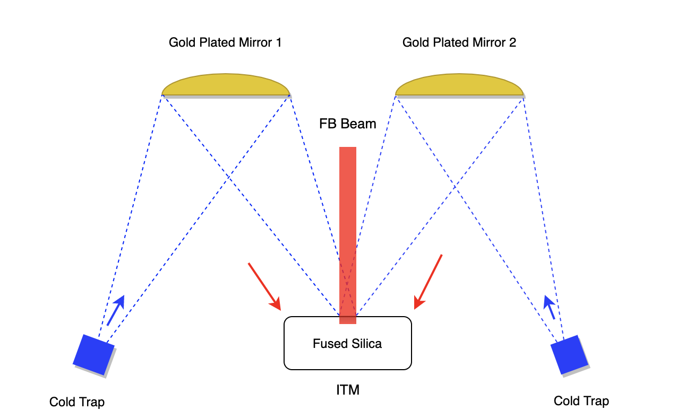
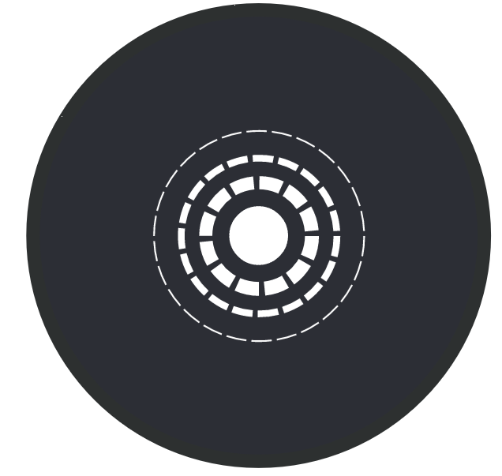
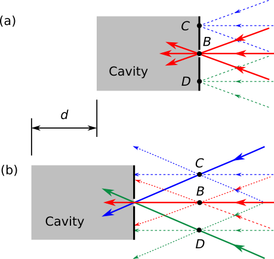

# Radiative cooling

The aim of the project is to design a system for extracting heat from a fused silica mirror taking advantage of the thermal radiation that it naturally and continously generates. (Say something about the context of the experiment.)

The aim is to extract exactly the same amount of heat that is generated as the laser passes through the mirror dissipating some of its power. The laser is a Guassian beam propagating on-axis, therefore, more heat is produced in the central region of the mirror than in the surronding areas. *The challenge then becomes extracting different amounts of heat from different areas of the mirror surface in accordance to the Guassian intensity profile of the beam.* 

Because thermal radiation is electromagnetic, the problem can be formulated in terms of ray tracing in an imaging system. Figure 1 shows the main mirror, the laser beam going through, two off-axis gold plated folding mirrors and two cold traps. The position of the folding mirrors are such that they produce  images of the *mirror* at the apertures of the cold traps.

<!--  -->

  
  Figure 1. Overview of the system.

These apertures are covered with masks like the one shown in Fig. 2, where the white sections are holes through which the light propagates. Their function is to allow more light from the centre of the mirror to reach the cold trap and less light from the areas away from it. 

   
  Figure 2. Mask covering the aperture of the cold trap.

Let's consider point $A$ on the mirror surface upon which the outskirt of the Guassian beam passes through. Figure 3(a) shows its image $B$ created very close to the edge of the aperture of the cold trap. All the rays converging at $B$ enter the trap. In this configuration, more heat than necessary enters the trap because the radiation from the different areas, within the region of the mirror imaged onto the aperture, enter the trap equally and not according to a Gaussian distribution.

      
     Figure 3.

In order to decrease the amount of radiation enterig the trap, the aperture can be moved back from the plane of the image as shown in Fig. 3(b), thus keeping some of the rays converging at $B$ from entering the cavity. The farther away the point is from the centre of the image, the more of its rays will miss the aperture. This produces a radial distribution of heat extraction, that does not exacty match a Guassian distribution but closely mimics it.

In term of images, the image of the mirror created at the new position of the aperture is out of focus. Conversely, the image of the cold trap aperture, created at the mirror surface, is a circle out of focus mimicking a Guassian beam intensity profile.

The position of the cold trap can be calculated with Zemax using standard techniques of image quality optimization once the spatial and directional properties of the thermal radiation at the surface of the fused silica mirror are known. A procedure would be as follows:

1. Given the positions of the main mirror and the folding mirror, calculate the position of the image that the folding mirror creates of the main mirror.
2. Optimize the shape of the folding mirror in order to minimize the effect of aberrations. It is recommended to use optical components from stock.
3. Using the spatial and directional properties of the thermal radiation, define an error function that becomes zero when the correct amount of heat reaches the aperture of the cold trap.
4. Calculate the new position of the cold trap aperture by minimizing the error function.
5. Check that the error function value is close enough to zero, condition that implies that the heat extracted is close enough to the optimum.
6. Determine which effect is dominant over the amount of heat extracted and over the quality of the image, the defocus or the aberrations introduced by the folding mirror. In case the defocus is far dominant, it might be worth relaxing the requirements imposed on the aberrations in case the selected folding mirror is not easy to acquire.

There is more yet to be written.

<!--

1. Given the properties of fused silica, the shape of the mirror, and the shape and power of the incoming beam, calculate the total amount of heat dissipated and the thermal radiant intensity (radiant flux per solid angle as a function of direction).
     
3. ~~Then, it should be possible to calculate the deformation and the temperature map of the mirror. For example, see [this technical note](https://www.google.com/url?sa=t&rct=j&q=&esrc=s&source=web&cd=&cad=rja&uact=8&ved=2ahUKEwiw47mF6t2CAxWWLUQIHc9PBQUQFnoECBQQAQ&url=https%3A%2F%2Fopensky.ucar.edu%2Fislandora%2Fobject%2Freports%253A7%2Fdatastream%2FPDF%2Fdownload%2Fcitation.pdf&usg=AOvVaw2-d9chybtS9aTcPbrS1V10&opi=89978449).~~

5. The folding mirrors must reflect *optimally* the radiation from the mirror into the sink, and the sink must keep it from returning to the mirror so the cooling ensues. Therefore, from the thermal radiant intensity, calculate the total solid angle the folding mirrors need to span, their shape, and the temperature and shape of the sinks, in order to extract more heat than the one deposited by the laser on the mirror. This is equivalent to saying that the *view factor* (also called *shape factor*) from the main mirror onto the sinks, via the folding mirrors, must be large enough. This is a calculation that could be done with Comsol (or the like).

With respect to the shape and material of the folding mirrors and the sinks:
- The folding mirrors can be coated with gold, wich offers an average reflectance larger than 97% from 800 nm to 20 $\rm \mu m$ [(see this link)](https://www.thorlabs.com/newgrouppage9.cfm?objectgroup_id=8851).
- The sinks could be cavities, coated in the inside with [Fractal Black](https://acktar.com/product/fractal-black/) (or the like), with an aperture big enough to allow the thermal radiation to enter. They must be connected to a conductive cooling system to regulate their temperature. 

Because radiation cooling is a well-known technique that does not require a proof-of-concept experiment, the experimental part of the project must prove it's possible to extract enough heat from a mirror *under similar circumstances than those found in a gravitational wave detector*. For example, the folding mirror and sink have to be outside of the clear aperture diameter of the main mirror, and must have certain shape and relative size with respect to it for ease of installation. Using optical components from stock, the aim would be to show that is it possible to build a cooling system with a view factor equal to the one that would be theoretically calculated for the real situation.

-->

