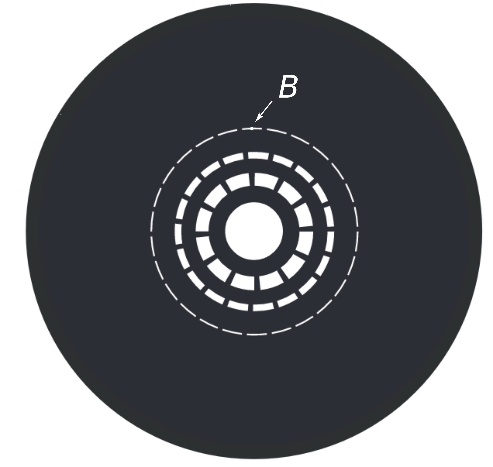

# Radiative cooling

The aim of the project is to design a system for extracting heat from a fused silica mirror taking advantage of the thermal radiation that it naturally and continously generates. (Say something about the context of the experiment.)

The aim is to extract exactly the same amount of heat that is generated as the laser passes through the mirror dissipating some of its power. The laser is a Guassian beam propagating on-axis, therefore, more heat is produced in the central region of the mirror than in the surronding areas. *The challenge then becomes extracting different amounts of heat from different areas of the mirror surface in accordance to the Guassian intensity profile of the beam.* 

Because thermal radiation is electromagnetic, the problem can be formulated in terms of ray tracing in an imaging system. Figure 1 shows the main mirror, the laser beam going through, two off-axis gold plated folding mirrors and two cold traps. The position of the folding mirrors are such that they produce  images of the *mirror* at the apertures of the cold traps.

<!--  -->

  
  Figure 1. Overview of the system.

These apertures are covered with masks like the one shown in Fig. 2, where the white sections are holes through which the light propagates. Their function is to allow more light from the central regions of the mirror to reach the cold trap and less light from the areas away from it. 

   
  Figure 2. Mask covering the aperture of the cold trap.

Let's consider point $A$ on the mirror surface upon which the outskirt of the Guassian beam passes through. Figure 2 shows at the uppermost slit of the mask its image $B$ created at the aperture of the trap. Figure 3(a) shows a cross section of such a vicinity. All the rays converging at $B$ enter the trap, whereas the rays converging at neighboring points $C$ and $D$ do not. In this configuration, only heat from the areas imaged at the holes can enter the trap, leaving behind the heat from other areas.

      
     Figure 3.

In order to allow rays from other areas to enter, the aperture can be moved back from the plane of the image as shown in Fig. 3(b). At this new position, some of the rays converging at $C$ and $D$ can pass through. By adjusting the position of the aperture and the shape of the mask, it is possible to extract heat according to a Gaussian profile.  

In term of images, the image of the main mirror created at the new position of the aperture is out of focus. Conversely, the image of the mask, created at the main mirror surface, is out of focus closely matching a Guassian beam intensity profile.

The optimum parameters of the system can be calculated with Zemax using standard techniques of image quality optimization once the spatial and directional properties of the thermal radiation at the surface of the fused silica mirror are known. The parameters to be determined are the precise shape of the mask and the amount of defocus required. A procedure would be as follows:

1. Given the positions of the main mirror and the folding mirror, calculate the position of the image that the folding mirror creates of the main mirror.
2. Optimize the shape of the folding mirror in order to minimize the effect of aberrations. It is recommended to use optical components from stock.
3. At the plane of the image set the mask.
4. *Using the spatial and directional properties of the thermal radiation*, define an error function that becomes zero when the correct amount of heat passes through the mask.
5. Calculate the new position of the mask by minimizing the error function.
6. Check that the error function value is close enough to zero, condition that implies that the heat extracted is close enough to the optimum. In case it is not, modify the shape of the mask and repeat the previous step.
7. Determine which effect is dominant over the amount of heat extracted and over the quality of the image, the defocus or the aberrations introduced by the folding mirror. In case the defocus is far dominant, it might be worth relaxing the requirements imposed on the aberrations in case the selected folding mirror is not easy to acquire.

<!--

1. Given the properties of fused silica, the shape of the mirror, and the shape and power of the incoming beam, calculate the total amount of heat dissipated and the thermal radiant intensity (radiant flux per solid angle as a function of direction).
     
3. ~~Then, it should be possible to calculate the deformation and the temperature map of the mirror. For example, see [this technical note](https://www.google.com/url?sa=t&rct=j&q=&esrc=s&source=web&cd=&cad=rja&uact=8&ved=2ahUKEwiw47mF6t2CAxWWLUQIHc9PBQUQFnoECBQQAQ&url=https%3A%2F%2Fopensky.ucar.edu%2Fislandora%2Fobject%2Freports%253A7%2Fdatastream%2FPDF%2Fdownload%2Fcitation.pdf&usg=AOvVaw2-d9chybtS9aTcPbrS1V10&opi=89978449).~~

5. The folding mirrors must reflect *optimally* the radiation from the mirror into the sink, and the sink must keep it from returning to the mirror so the cooling ensues. Therefore, from the thermal radiant intensity, calculate the total solid angle the folding mirrors need to span, their shape, and the temperature and shape of the sinks, in order to extract more heat than the one deposited by the laser on the mirror. This is equivalent to saying that the *view factor* (also called *shape factor*) from the main mirror onto the sinks, via the folding mirrors, must be large enough. This is a calculation that could be done with Comsol (or the like).

With respect to the shape and material of the folding mirrors and the sinks:
- The folding mirrors can be coated with gold, wich offers an average reflectance larger than 97% from 800 nm to 20 $\rm \mu m$ [(see this link)](https://www.thorlabs.com/newgrouppage9.cfm?objectgroup_id=8851).
- The sinks could be cavities, coated in the inside with [Fractal Black](https://acktar.com/product/fractal-black/) (or the like), with an aperture big enough to allow the thermal radiation to enter. They must be connected to a conductive cooling system to regulate their temperature. 

-->

